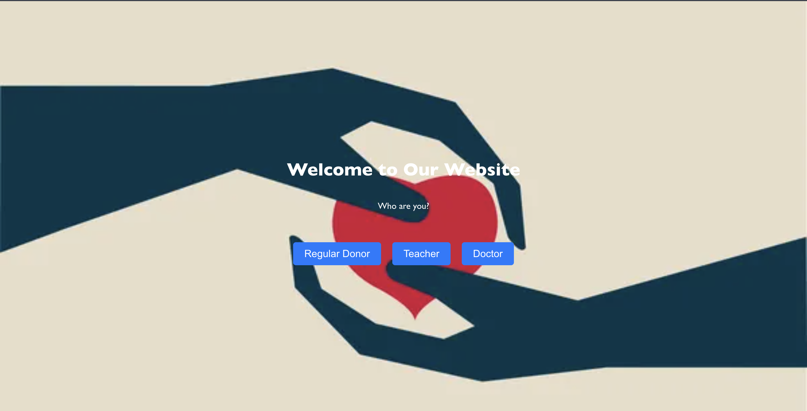
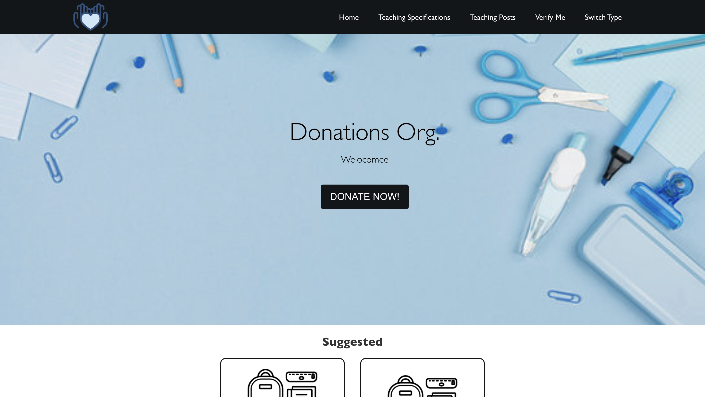
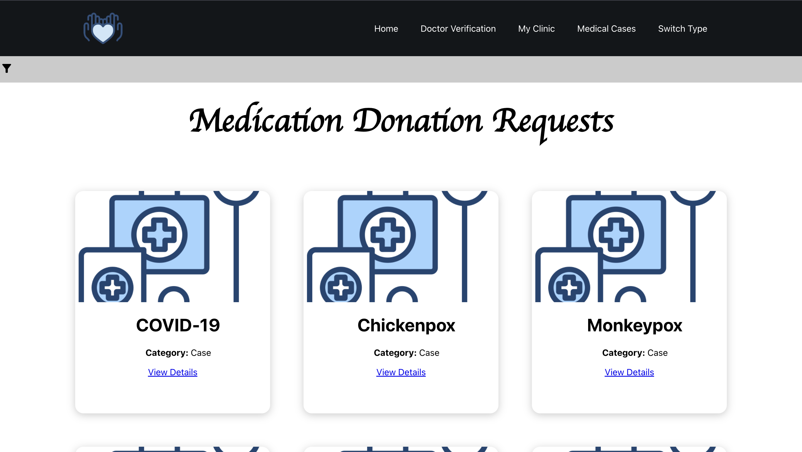
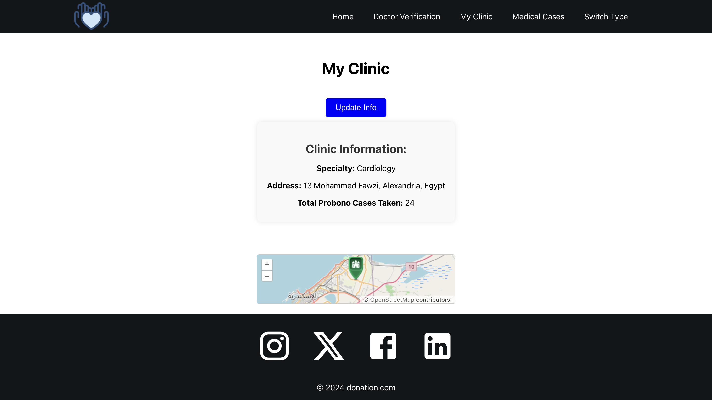
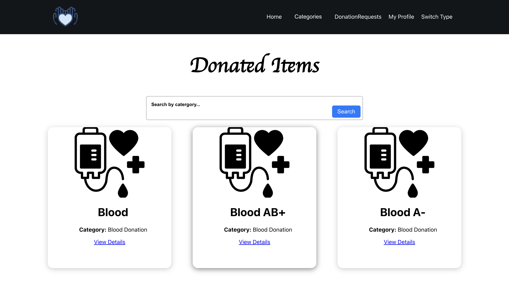

# Health Donation Application

A non-monetary donation platform developed as part of the Software Engineering course (Spring 2024) at the German University in Cairo (GUC).

The application connects donors with individuals and organizations in need of healthcare-related donations, including blood donations, medical supplies, medication, and pro-bono medical services.

## Project Description

The system aims to simplify the donation process by allowing donors, healthcare organizations, and donation receivers to communicate, submit requests, and track donations.

The application supports the following stakeholders:

- Donors
- Donation receivers
- Hospitals and healthcare organizations
- Delivery personnel
- Administrators

## Features

### Blood Donations
- Find available blood donation drives
- View urgent blood requests
- Connect donors with hospitals and patients

### Medical Supplies and Medication
- Browse medical donation requests
- Submit donation offers
- Match available donations with people in need

### Pro-Bono Medical Services
- Connect patients with doctors providing free services
- Manage appointment requests

### Donation Pickup and Delivery
- Request donation pickup
- Assign delivery personnel
- Track donation delivery status

## Technologies Used

- HTML
- CSS
- JavaScript

## Project Milestones

### Milestone 1: Requirements Engineering

- Identified system stakeholders
- Defined functional requirements using user stories
- Defined non-functional requirements
- Analyzed system needs and requirements

### Milestone 2: Frontend Development

- Designed and implemented the web application frontend
- Developed user interfaces based on user journeys
- Applied UI/UX principles
- Created a responsive design

## Team Members

- Malak Ragaie
- Youssef Eloraby
- David George
- Ahmed Backar
- Mohamed Hegazy

## Course Information

Course: Software Engineering  
Semester: Spring 2024  
University: German University in Cairo (GUC)

This project was developed for educational purposes as part of the Software Engineering course at GUC.

## Screenshots

### Select User

### Home Page

### Medication Donation Requests

### Doctor's Clinic

### Donated Items

